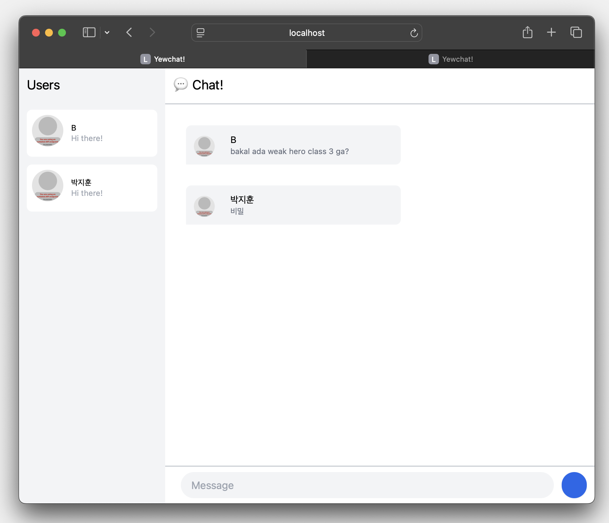
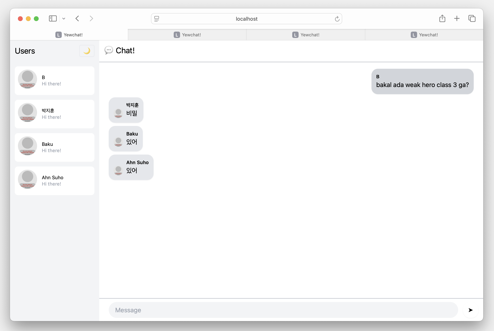
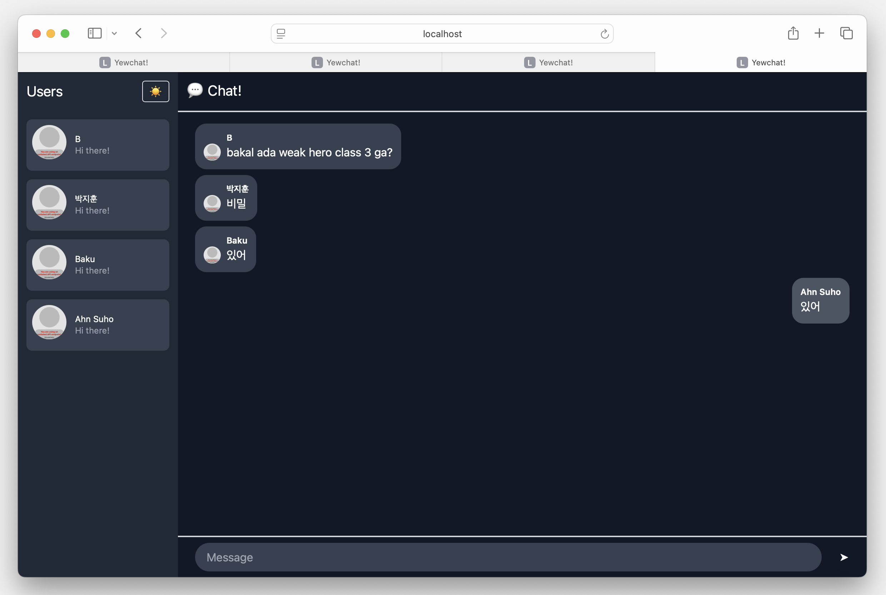

# Modul 10 Pemrograman Lanjut : Asynchronous Programming
oleh **Brenda Po Lok Fahida**

 
 

## Experiment 3.1: Original code

> Source code for [Let’s Build a Websocket Chat Project With Rust and Yew 0.19 🦀](https://fsjohnny.medium.com/lets-build-a-websockets-project-with-rust-and-yew-0-19-60720367399f)

 

Setelah menjalankan `npm start` pada YewChat dan Simple WebSocket Server, kita dapat melihat bahwa YewChat dapat berjalan dengan baik. Kita dapat mengirim pesan dan menerima pesan dari _chat room_.

## Experiment 3.2: Be Creative!

Pada eksperimen ini, saya melakukan beberapa penyesuaian tampilan dan interaksi agar aplikasi chat terasa lebih modern, nyaman digunakan, dan menyerupai aplikasi perpesanan yang umum digunakan sehari-hari. Perubahan utama yang saya terapkan adalah penambahan fitur toggle tema antara mode terang (light) dan mode gelap (dark), sehingga pengguna dapat menyesuaikan tampilan sesuai preferensi visual mereka.

Selain itu, tampilan bubble chat diperbarui agar posisi pesan menyesuaikan pengirim. Pesan dari pengguna lain muncul di sebelah kiri, sementara pesan dari saya muncul di sebelah kanan. Hal ini membuat alur percakapan lebih intuitif dan mudah dipahami. Warna latar setiap bubble chat juga disesuaikan agar tetap dalam nuansa abu-abu, namun dengan kontras yang pas untuk membedakan pengirim pesan tanpa harus menggunakan warna mencolok.